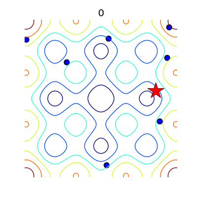
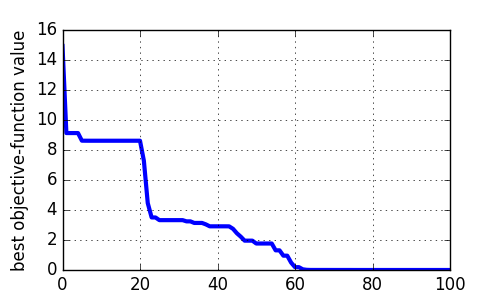
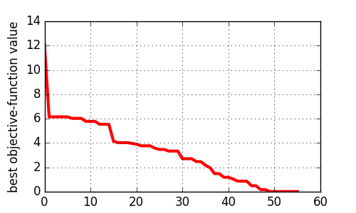
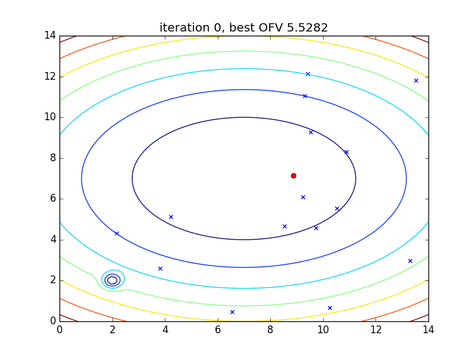

# em-optimizer
A Python implementation of the Electromagnetism-like Mechanism for global optimization.


## Overview
We implement EM, a heuristic for bounded optimization problems. This is a stochastic algorithm, which basically uses particles that attract or repel each other according to the objective function value at their locations. The objective function is from R^n to R, and it does not need to be convex. Gradients are not used, so the algorithm can be used for complicated functions as well.

For algorithmic and theoretical details, see Birbil and Fang, [_An Electromagnetism-like Mechanism for Global Optimization_](http://www.academia.edu/download/30818603/pub2.pdf), Journal of Global Optimization (25), 263-282, 2003.
## Usage
The code is organized simply in a single class, `EMoptimizer`. The initialization is as follows:

```
EMoptimizer(dim, nparticles, objective, lower, upper,stepreduction = False, circular = False)
```
Initialization parameters:
* `dim`: The dimension of the problem (how many arguments the objective function takes)
* `nparticles`: The number of particles used in the algorithm.
* `objective`: The objective function. Must be in the form `f(x)`, with `x` an iterable with `dim` elements.
* `lower`: The lower "corner" of the optimization region. An iterable with `dim` elements.
* `upper`: The upper "corner" of the optimization region. An iterable with `dim` elements.
* `stepreduction`: If True, the step size is multiplied with (1+iterno)<sup>-1/4</sup>. Default: False.
* `circular`: If True, particles wrap around when they leave the optimization region (out from one side, in from the opposite side). Default: False

Attributes and methods:
* `iterno`: The current iteration number.
* `iterate()`: Make one iteration of the algorithm over all particles.
* `getpos()`: Return the positions of all particles; an `nparticles`-by-`dim` array.
* `getofv()`: Return the objective function values of all particles; an array of size `nparticles`.
* `getbestpos()`: Return the position of the current best particle; an array of size `dim`.
* `getbestofv()`: Return the objective function value of the current best particle.

## Example: Run for a fixed number of iterations
Before the optimizer is called, an objective function must be defined. We define the [Alpine 02 function](https://arxiv.org/abs/1308.4008) in two dimensions, then initialize the optimizer with this objective. Finally, we iterate the optimizer 20 times and print the result.

```
import numpy as np
from emoptimizer import EMoptimizer

def alpine02(x):
    # range: [0,10] in each direction
    # Global minimum near (8,8)
    return -np.sqrt(x[0]*x[1])*np.sin(x[0])*np.sin(x[1])
    
em = EMoptimizer(dim=2, nparticles=16, objective=alpine02, lower=[0,0], upper=[10,10])
while em.iterno < 20:
  em.iterate()
print em.getbestpos(), em.getbestofv()
```
## Example: Plot the convergence curve
```
import numpy as np
import matplotlib.pylab as plt
from emoptimizer import EMoptimizer

def ackley(x):
    # range : [-32,32] in each direction
    # global minimum at (0,0)
    return -20*np.exp(-0.2*np.sqrt((x[0]**2+x[1]**2)/2)) - \
    np.exp(0.5*(np.cos(2*np.pi*x[0]) + np.cos(2*np.pi*x[1]))) + 20 + np.exp(1)

em = EMoptimizer(dim=2, nparticles=16, objective=ackley, lower=[-32,-32], upper=[32,32])

ofvlist = [em.getbestofv()]

# Follow for 100 iterations
while(em.iterno < 100):
    em.iterate()
    ofvlist.append(em.getbestofv())

plt.figure()
plt.plot(ofvlist)
```


Alternatively, we can follow until the objective function value drops below a certain level.
```
em = EMoptimizer(dim=2, nparticles=16, objective=ackley, lower=[-32,-32], upper=[32,32])

ofvlist = [em.getbestofv()]

while(ofvlist[-1] > 0.01 and em.iterno < 10000):
    em.iterate()
    ofvlist.append(em.getbestofv())

plt.figure()
plt.plot(ofvlist)
```


## Example: Display particle positions at each iteration step
Note: The following code will create 100 PNG files in the working directory.

```
import numpy as np
import matplotlib.pylab as plt
from emoptimizer import EMoptimizer

def damavandi(x):
    # Range: [0,14] in each dimension
    # Global minimum at (2,2)
    x1,x2 = x[0], x[1]
    y1,y2 = np.pi*(x1-2), np.pi*(x2-2)
    return ( 1 - abs( np.sin(y1)*np.sin(y2) / (y1*y2) )**5 ) * (2 + (x1-7)**2 + 2*(x2-7)**2)

def damavandiV(x,y): # vectorized form for plotting
    return ( 1 - abs( np.sin(np.pi*(x-2))*np.sin(np.pi*(y-2)) / (np.pi**2 * (x-2)*(y-2)) )**5 ) * (2 + (x-7)**2 + 2*(y-7)**2)

xmin, xmax, ymin, ymax = 0,14,0,14
    
x = np.linspace(xmin, xmax, 100)
y = np.linspace(ymin, ymax, 100)
X, Y = np.meshgrid(x,y)
Z = damavandiV(X,Y)

nparticles = 16
maxiters = 100
em = EMoptimizer(2, nparticles, damavandi, [xmin,ymin],[xmax,ymax])

while(em.iterno <= maxiters):

    plt.contour(X,Y,Z) # plot the contours
    # show particles as crosses
    plt.scatter(em.getpos()[:,0], em.getpos()[:,1],marker="x")
    # show the best point as a red circle         
    plt.plot(em.best.pos[0],em.best.pos[1],"ro")
    plt.title("iteration %d, best OFV %.4f" % (em.iterno,em.getbestofv()))
    plt.xlim(xmin,xmax)
    plt.ylim(ymin,ymax)
    # save as png file, named 000.png to 100.png
    plt.savefig("%03d.png" % (em.iterno,),format="png")
    plt.clf()
    
    em.iterate()
```
Below we see the initial position of the particles and a contour plot of the Damavandi function. The red circle is the particle with the lowest objective function value. Particles are placed at random, so your results will vary.

